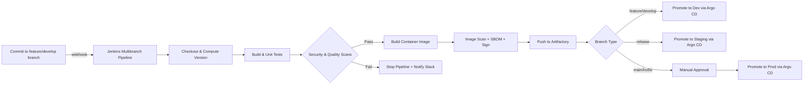
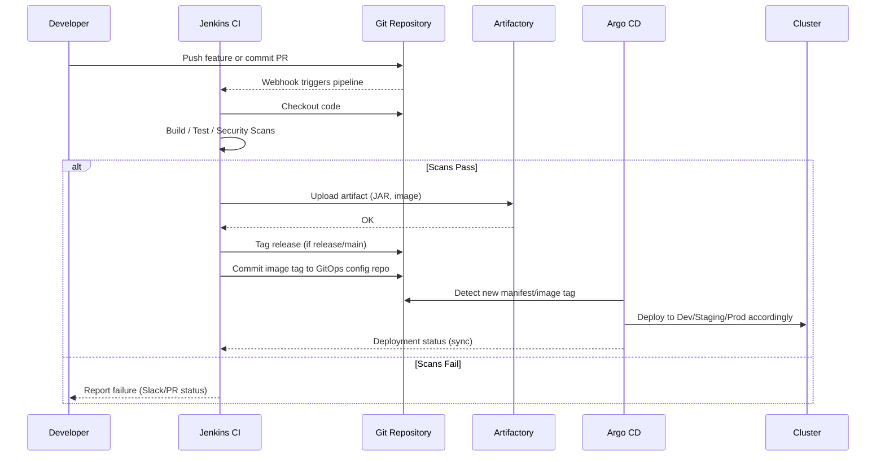
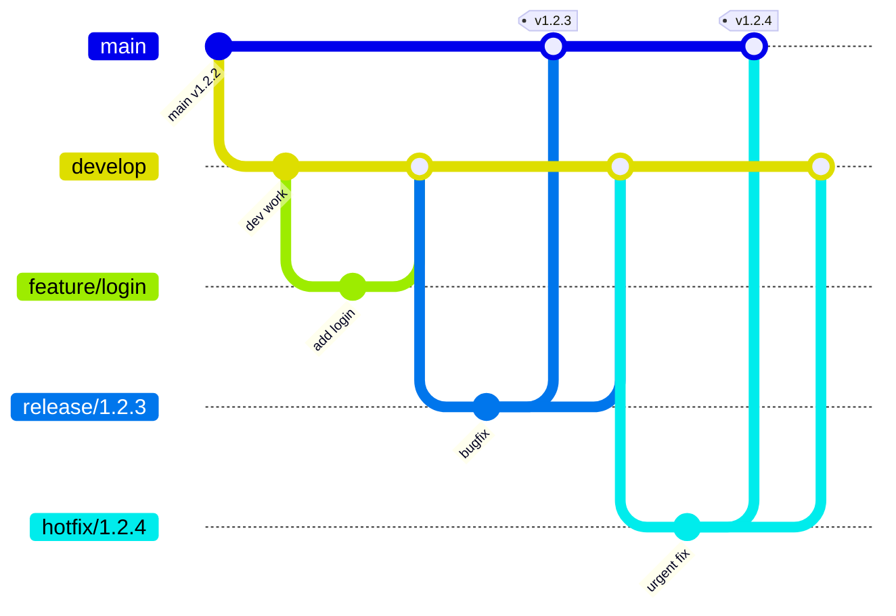

# Diagrams

## High-level CI/CD flow

```mermaid
graph LR
    A[Commit to feature/develop branch] -->|webhook| B[Jenkins Multibranch Pipeline]
    B --> C[Checkout & Compute Version]
    C --> D[Build & Unit Tests]
    D --> E{Security & Quality Scans}
    E -->|Pass| F[Build Container Image]
    F --> G[Image Scan + SBOM + Sign]
    G --> H[Push to Artifactory]
    H --> I{Branch Type}
    I -->|feature/develop| J[Promote to Dev via Argo CD]
    I -->|release| K[Promote to Staging via Argo CD]
    I -->|main/hotfix| L[Manual Approval]
    L --> M[Promote to Prod via Argo CD]
    E -->|Fail| X[Stop Pipeline + Notify Slack]
```

## Promotion timeline (sequence)

```mermaid
sequenceDiagram
    participant Dev as Developer
    participant CI as Jenkins CI
    participant Git as Git Repository
    participant Art as Artifactory
    participant Argo as Argo CD
    participant K8s as Cluster

    Dev->>Git: Push feature or commit PR
    Git-->>CI: Webhook triggers pipeline
    CI->>Git: Checkout code
    CI->>CI: Build / Test / Security Scans

    alt Scans Pass
        CI->>Art: Upload artifact (JAR, image)
        Art-->>CI: OK
        CI->>Git: Tag release (if release/main)
        CI->>Git: Commit image tag to GitOps config repo
        Argo->>Git: Detect new manifest/image tag
        Argo->>K8s: Deploy to Dev/Staging/Prod accordingly
        Argo-->>CI: Deployment status (sync)
    else Scans Fail
        CI-->>Dev: Report failure (Slack/PR status)
    end
```

## GitFlow branch topology

```mermaid
gitGraph
    commit id: "main v1.2.2"
    branch develop
    checkout develop
    commit id: "dev work"
    branch feature/login
    checkout feature/login
    commit id: "add login"
    checkout develop
    merge feature/login
    branch release/1.2.3
    checkout release/1.2.3
    commit id: "bugfix"
    checkout main
    merge release/1.2.3 tag: "v1.2.3"
    checkout develop
    merge release/1.2.3
    branch hotfix/1.2.4
    checkout hotfix/1.2.4
    commit id: "urgent fix"
    checkout main
    merge hotfix/1.2.4 tag: "v1.2.4"
    checkout develop
    merge hotfix/1.2.4
```
